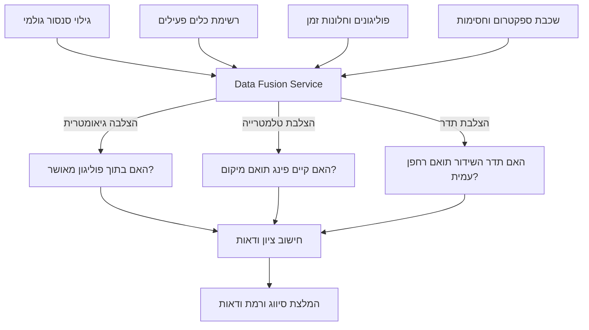

# מפרט טכני לעומק: מנגנון זיהוי עמית/טורף (IFF)
**מנוע היתוך מידע, ניהול אי-ודאות וקבלת החלטות במרחב האווירי**

---

## 1. מחזור חיי אירוע זיהוי (Event Triggering)
אירוע זיהוי (Identification Event) במערכת רוק"ק נפתח אוטומטית או ידנית במקרים הבאים:

1. **פתיחה אוטומטית (סנסור):** קבלת גילוי חדש מסנסור פיזי (מכ"ם, RF, אופטי, אקוסטי) במרחב האווירי הטקטי אשר לא ניתן לשייך אותו ברמת ודאות גבוהה (מעל 85%) לכלי טיס ידידותי המשדר טלמטרייה פעילה.
2. **פתיחה אוטומטית (חריגה):** כלי טיס ידידותי פעיל (עמית) החורג מגבולות הגובה המאושרים שלו (סטייה של מעל 15 מטרים) או יוצא מגבולות הפוליגון המאושר שלו (מעל 50 מטרים) למשך יותר מ-5 שניות רצופות.
3. **פתיחה ידנית:** דיווח מהשטח (מפעיל או כוח קרקעי) על זיהוי ויזואלי/אקוסטי של כלי טיס חשוד במרחב.

---

## 2. מנוע היתוך והצלבת מידע (Data Fusion & Cross-Referencing)
כאשר נקלט דיווח או גילוי, המערכת מבצעת הצלבה מרחבית וזמנית (Spatial-Temporal Correlation) מול שכבות המידע הבאות:



### מאפייני ההצלבה:
* **שיוך טלמטרייה למטרה (Track Association):** המערכת בודקת האם קיים `PingStatus` פעיל מאול"ר שהתקבל ב-3 השניות האחרונות, במרחק גיאוגרפי של פחות מ-50 מטרים (דו-ממד) והפרש גובה של פחות מ-15 מטרים מגילוי המכ"ם.
* **הצלבת תדרים וספקטרום:** בדיקה האם המטרה משדרת בתדר הרשום של הרחפן המאושר, והאם המיקום נמצא תחת השפעת חסימת ספקטרום פעילה (ל"א כוחותינו) שיכולה להסביר חוסר דיווח של האול"ר.

---

## 3. מודל חישוב רמת ודאות (Certainty Score Calculation)
הוודאות מחושבת באמצעות שקלול משקולות (Weighted Score Model). הציון הסופי ($S$) נע בין `0.0` (אויב ודאי) ל-`1.0` (עמית ודאי).

$$S = \sum (w_i \cdot x_i)$$

| פרמטר ($x_i$) | משקל ($w_i$) | תיאור השפעה על הציון |
| :--- | :--- | :--- |
| **התאמת פינג (Active Ping)** | $+0.40$ | התקבל פינג טלמטריית אול"ר תואם מיקום וזמן בטווח של 50 מ'. |
| **התאמת פוליגון וזמן** | $+0.25$ | המיקום והזמן נמצאים בתוך פוליגון טיסה מאושר. |
| **חתימת תדר RF ידידותית** | $+0.15$ | סנסור ה-RF מזהה אות המקודד כרחפן צה"לי רשום. |
| **דיווח "ירוק בעיניים" מהשטח** | $+0.20$ | כוח מדווח על זיהוי ויזואלי של כלי ידידותי. |
| **חתימת RF עוינת** | $-0.50$ | סנסור RF מזהה פרוטוקול שידור המאפיין כלים עוינים. |
| **חריגת מהירות (Radar)** | $-0.30$ | מהירות מעל 100 קמ"ש (לא סביר לרחפן כוחותינו טקטי). |
| **חדירה ל-NFZ קריטי** | $-0.25$ | המטרה טסה בתוך שטח הגנה מוגדר ללא הרשאה. |

### הגדרת רף הסטטוסים לפי הציון הסופי ($S$):
* **כחול ודאי (Blue Certain):** $S \ge 0.85$ (למשל: פינג תקין + פוליגון מאושר + תדר תקין).
* **כחול חשוד (Blue Suspicious):** $0.65 \le S < 0.85$ (למשל: יש פינג מהאול"ר, אך המטיס לא רשם תוכנית טיסה והכלי מחוץ לפוליגון).
* **כחול חריג (Blue Anomalous):** $0.55 \le S < 0.65$ (למשל: יש תוכנית ופינג, אך הכלי חורג משמעותית בגובה או במיקום).
* **בלתי מזוהה (Unidentified):** $0.40 \le S < 0.55$ (למשל: גילוי מכ"ם בלבד ללא שום מידע נוסף).
* **אדום חשוד (Red Suspicious):** $0.20 \le S < 0.40$ (למשל: גילוי מכ"ם ללא פינג, המציג מהירות תנועה חריגה או נמצא ליד NFZ).
* **אדום ודאי (Red Certain):** $S < 0.20$ (למשל: חתימת RF עוינת מאומתת או דיווח עין של כוח על רחפן עוין).
* **מידע סותר (Conflicting Data):** מופעל כאשר יש שני אינדיקטורים חזקים ומנוגדים (למשל: פינג אול"ר פעיל בו-זמנית עם זיהוי RF עוין באותו נ"צ).

---

## 4. טבלת החלטות לוגית (Decision Table)

להלן הטבלה המנחה את מנוע החוקים הליניארי של המערכת:

| פינג אול"ר | בתוך פוליגון | תדר RF | מהירות/גובה | דיווח מהשטח | סטטוס מומלץ | רמת ודאות |
| :---: | :---: | :---: | :---: | :---: | :--- | :---: |
| **כן** | **כן** | תקין | תואם | אין | **כחול ודאי** | $95\%$ |
| **כן** | **לא** | תקין | תואם | אין | **כחול חשוד** | $70\%$ |
| **כן** | **כן** | תקין | חריג | אין | **כחול חריג** | $60\%$ |
| **לא** | **לא** | לא מזוהה | תואם | אין | **בלתי מזוהה** | $45\%$ |
| **לא** | **לא** | עוין | חריג | אין | **אדום חשוד** | $30\%$ |
| **לא** | **לא** | עוין | חריג | עוין (אופטי) | **אדום ודאי** | $10\%$ |
| **כן** | **כן** | עוין | תואם | אין | **מידע סותר** | $50\%$ |

---

## 5. נהלים מבצעיים: "נמר" ו"פטיש אוויר"

### 5.1. נוהל נמר (Tiger Procedure) - הכרזת כלי עוין
* **מתי מופעל:** במקרה של זיהוי מטרה בסטטוס **אדום חשוד** או **אדום ודאי** הנמצאת בנתיב התקדמות לכוחותינו.
* **איך מופעל:** קצין הרוק"ק לוחץ על כפתור `Activate Tiger` במסך האירוע.
* **השלכות מערכתיות:**
  1. השרת שולח מיידית התרעת Push לכל מכשירי האול"ר (Android) בגזרה.
  2. האפליקציה בשטח משמיעה צפצוף חירום קולי ומציגה את מיקום ה"נמר" והערכת כיוון תנועתו.
  3. כל תוכניות הטיסה הידידותיות באותה גזרה נכנסות למצב השהיה (Suspended).

### 5.2. נוהל פטיש אוויר (Air Hammer) - פקודת יירוט/נטרול
* **מתי מופעל:** נוהל נמר פעיל + אישור סופי של קצין רוק"ק כי הכלי מהווה איום מיידי ונדרש נטרול (פיזי או אלקטרוני).
* **איך מופעל:** לחיצה על כפתור `Declare Air Hammer` וסימון נפח היירוט במפה.
* **השלכות מערכתיות:**
  1. מופצת פקודה באול"ר לכל הכלים הידידותיים בגזרה: **"נחיתת חירום מיידית!"** כדי לפנות את המרחב ולאפשר ל"א/נטרול נקי.
  2. נרשמת פקודה במערכת ה-Audit Log.

---

## 6. טיפול במקרי קצה (Edge Cases)

* **מקרה 1: אין פוליגון פעיל אך ייתכן שזה כלי שלנו (מטיס שכח להזין בקשה)**
  * *פעולה:* המערכת תסווג כ**כחול חשוד** (עקב הימצאות פינג אול"ר ללא פוליגון). לקצין הרוק"ק תוצג המלצה: *"נמצא פינג פעיל של מפעיל רשום. האם לאשר פוליגון בדיעבד?"*.
* **מקרה 2: כמה פוליגונים פעילים חופפים באותו אזור ונקלטה מטרה לא מזוהה**
  * *פעולה:* המערכת לא תדע לשייך את המטרה אוטומטית לכלי ספציפי. המטרה תסומן כ**בלתי מזוהה** ותקבל חיווי של "חפיפת מרחב". לקצין יוצגו שני הכלים הידידותיים הפוטנציאליים עם כפתורי בחירה לשיוך ידני.
* **מקרה 3: כלי מחוץ לפוליגון המאושר או בגובה לא תואם**
  * *פעולה:* המערכת משנה את הסטטוס ל**כחול חריג**. נשלחת התרעה אוטומטית לאול"ר המטיס: *"שים לב, חריגה מנתיב/גובה מאושר. חזור מייד למסלול"*.
* **מקרה 4: סנסור מזהה אדום אך יש פוליגון כחול סמוך**
  * *פעולה:* המערכת תבצע בדיקה האם הפרש המרחקים קטן מסף השגיאה של הסנסור (למשל, 100 מטר למכ"ם טקטי). במידה וכן, המטרה תסווג כ**מידע סותר** ולקצין יוצע לבקש מהמטיס "ירוק בעיניים" (אימות עין).
* **מקרה 5: כוח מדווח "ירוק בעיניים" (ידידותי) אך הסנסור מזהה איום (עוין)**
  * *פעולה:* המערכת תיתן קדימות לזיהוי העין האנושי אך תשאיר את סטטוס המטרה כ**מידע סותר** עם רמת ודאות בינונית (50%). היא תמנע הפעלת פטיש אוויר אוטומטית ותדרוש אישור מפקד חטיבה בקשר.
* **מקרה 6: שינוי גובה בנוהל נמר לא ניתן לאימות**
  * *פעולה:* כאשר מוכרז נמר, המפעילים נדרשים להנמיך גובה מתחת ל-20 מטר. אם כלי לא משדר גובה אמין עקב שיבוש GPS, המערכת תציג אותו כ**כחול חריג (חשוד בטיסה בגובה עוין)** עד לאימות קשר עין.

---

## 7. ממשק משתמש (UI למסך אירוע זיהוי)

מסך האירוע מעוצב כחלונית צדדית הנפתחת ב-Web בעת בחירת אירוע פעיל:

```
+-------------------------------------------------------------+
| אירוע זיהוי #INC-8812                                        |
+-------------------------------------------------------------+
| סטטוס נוכחי: [בלתי מזוהה] (צהוב)                             |
| ודאות מערכת: 48%                                             |
+-------------------------------------------------------------+
| מקורות גילוי פעילים:                                         |
| • מכ"ם חטיבה (טראק #4011) - פעיל (לפני 1ש')                  |
| • סנסור RF (אות לא מזוהה) - פעיל (לפני 3ש')                  |
+-------------------------------------------------------------+
| הצלבת שכבות:                                                |
| [X] אין פינג אול"ר תואם באזור                               |
| [X] אין פוליגון מאושר בטווח של 500 מ'                        |
| [!] אזור חסימת ספקטרום פעיל (תדר 2.4G) במרחק 1.2 ק"מ         |
+-------------------------------------------------------------+
| פעולות מפקד:                                                |
| [הכרז נמר (עוין)] (אדום)                                     |
| [הכרז כחול (ידידותי ידני)] (ירוק)                             |
| [בקש אימות ירוק בעיניים מהשטח] (צהוב)                        |
+-------------------------------------------------------------+
```

---

## 8. הגדרת ישויות דאטה ו-APIs ייעודיים

### 8.1. מודל דאטה בסיסי (PostgreSQL Schema snippet)
```sql
CREATE TYPE iff_status_enum AS ENUM (
    'BLUE_CERTAIN', 'BLUE_SUSPICIOUS', 'BLUE_ANOMALOUS', 
    'UNIDENTIFIED', 'RED_SUSPICIOUS', 'RED_CERTAIN', 'CONFLICTING'
);

CREATE TYPE incident_status_enum AS ENUM (
    'OPENED', 'ACTIVE_TIGER', 'ACTIVE_HAMMER', 'RESOLVED'
);

CREATE TABLE identification_events (
    id UUID PRIMARY KEY DEFAULT gen_random_uuid(),
    target_track_id VARCHAR(100) NOT NULL,
    current_iff_status iff_status_enum NOT NULL DEFAULT 'UNIDENTIFIED',
    certainty_level NUMERIC(3,2) NOT NULL DEFAULT 0.50,
    status incident_status_enum NOT NULL DEFAULT 'OPENED',
    reporter_user_id UUID REFERENCES users(id),
    resolution_notes TEXT,
    created_at TIMESTAMP WITH TIME ZONE DEFAULT CURRENT_TIMESTAMP,
    updated_at TIMESTAMP WITH TIME ZONE DEFAULT CURRENT_TIMESTAMP,
    created_by UUID REFERENCES users(id),
    updated_by UUID REFERENCES users(id)
);
```

### 8.2. נתיבי API (Endpoints)
* **פתיחת אירוע זיהוי ידני / סיווג ראשוני:**
  * `POST /api/v1/incidents`
  * תגובה: `201 Created` עם ה-UUID של האירוע.
* **העברת סיווג ידני (עמית/טורף):**
  * `POST /api/v1/incidents/{id}/classify`
  * גוף הבקשה: `{ "iff_status": "RED_CERTAIN", "notes": "זיהוי אופטי מאומת" }`
* **הפעלת נוהל נמר (Tiger):**
  * `POST /api/v1/incidents/{id}/tiger`
  * תגובה: `200 OK` (מפעיל את שידור ה-Push לשטח).
* **הכרזת פטיש אוויר (Air Hammer):**
  * `POST /api/v1/incidents/{id}/hammer`
  * גוף הבקשה: `{ "affected_area": { "type": "Polygon", "coordinates": [...] } }`
* **דיווח "ירוק בעיניים" מהשטח (מכשיר Android):**
  * `POST /api/v1/incidents/{id}/green-in-eyes`
  * גוף הבקשה: `{ "confirmed": true, "notes": "זיהוי בעיניים" }`
