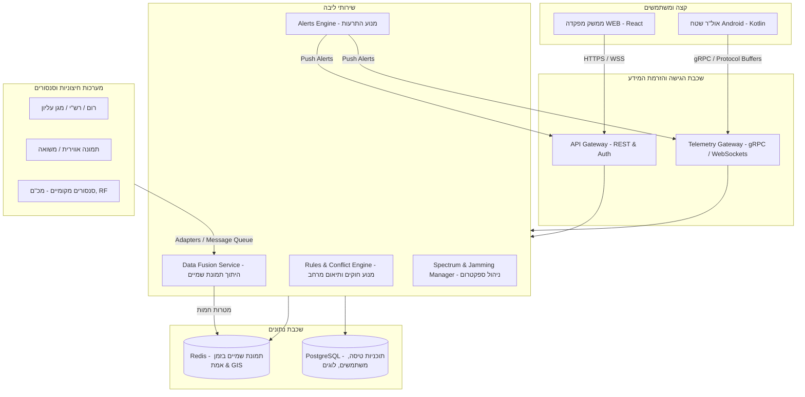
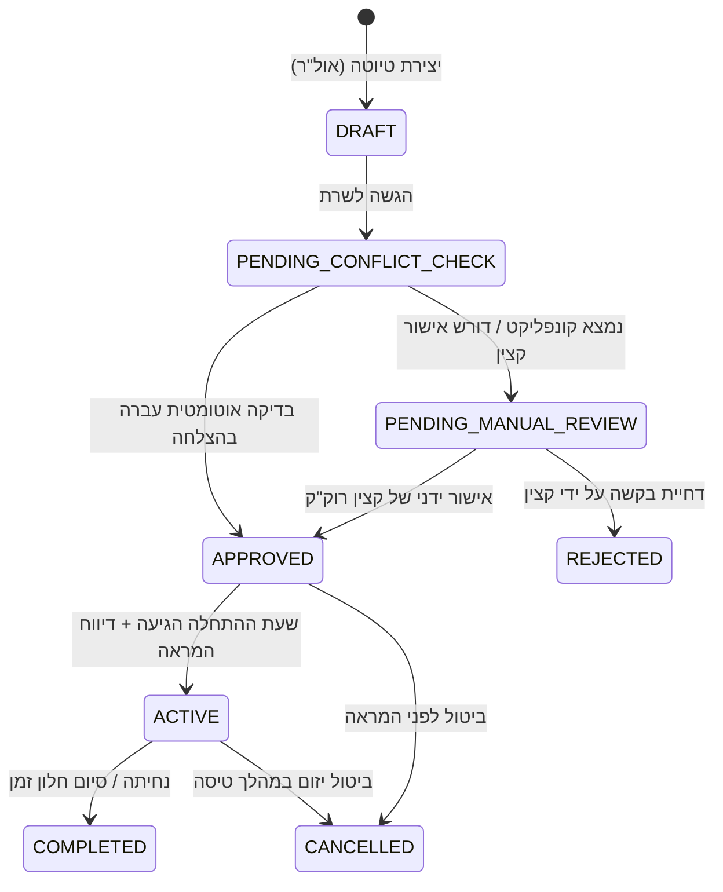
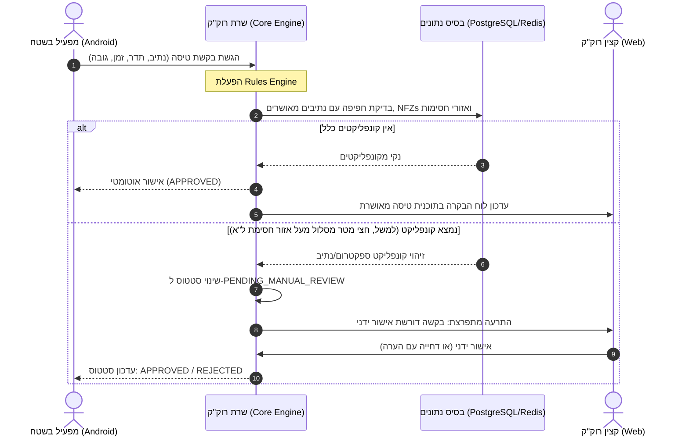

# מסמך איפיון מערכת: רוק״ק טקטי (Tactical Airspace Management System)
**מקור אמת אחוד לניהול מרחב אווירי טקטי בזמן אמת**

---

## 1. חזון ומטרת המערכת
מערכת **רוק״ק טקטי** נועדה לייצר מקור אמת אחד (Single Source of Truth) לתמונת שמיים אחידה, אמינה ועדכנית במרחב החטיבתי. המערכת מייעלת ומאבטחת את פעילות הכלים האוויריים הטקטיים (רחפנים, כטב"מים טקטיים) באמצעות היתוך מידע ממערכות מבוזרות, אוטומציה של אישורי טיסה, זיהוי עמית/טורף (IFF), ניהול ספקטרום דינמי למניעת שיבושים עצמיים, וניהול יעיל של אירועים מבצעיים ("נמר", "פטיש אוויר").

المערכת כוללת שני ממשקים:
1. **ממשק WEB למפקדה / תא רוק״ק חטיבתי:** שליטה ובקרה מלאה, אישור תוכניות טיסה, ניהול אירועים והגדרת מגבלות מרחב וספקטרום.
2. **אפליקציית Android (אול״ר רשתי) לכוחות ומפעילים בשטח:** תמונת מצב מקומית, הגשת בקשות טיסה מהירות, קבלת התרעות ספקטרום ואיומים בזמן אמת, ושידור טלמטריית מיקום עצמית.

---

## 2. הנחות יסוד (Assumptions)
> [!NOTE]
> * **הנחה 1 - תקשורת בשטח:** למפעילי ה-Android בשטח יש קישוריות נתונים על גבי רדיו טקטי (כגון תג"ם רחב-סרט) או רשת סלולרית ייעודית. התקשורת עשויה לסבול מרוחב פס נמוך, השהיות (Latency) ונתקים זמניים.
> * **הנחה 2 - זיהוי עמית/טורף (IFF) מבוסס טלמטרייה:** כלי טיס של כוחותינו (עמית) יזוהה במערכת על בסיס התאמה גיאוגרפית וזמנית בין תוכנית טיסה מאושרת, שידור טלמטרייה פעיל מאפליקציית ה-Android (אול"ר), לבין המטרה הנקלטת בסנסורים.
> * **הנחה 3 - הגדרת אירועי "נמר" ו"פטיש אוויר":** 
>   * **"נמר" (Tiger):** אירוע כניסת כלי טיס עוין או חשוד למרחב האווירי הטקטי.
>   * **"פטיש אוויר" (Hammer):** פקודה/אירוע הפעלה של אמצעי נטרול (ל"א, ירי פיזי או יירוט) כנגד מטרה עוינת.
> * **הנחה 4 - אינטגרציה עם מערכות חיצוניות:** מערכות צה"ליות משיקות (כמו רום, רש"י, מגן עליון, תמונה אווירית, משואה וסנסורים מקומיים) מספקות ממשקי קצה (APIs/Streams) לשיתוף נתוני מטרות, תוכניות טיסה של מטוסים מאוישים, ומיקומי כוחות קרקעיים. המערכת שלנו תבצע היתוך וסינון של נתונים אלו.
> * **הנחה 5 - רמות אבטחת מידע וסיווג:** המערכת מתוכננת לארכיטקטורה מבוזרת המאפשרת עבודה ברשתות מבצעיות מסווגות, תוך הגנה על מיקומי המפעילים והכלים.

---

## 3. שאלות פתוחות (Open Questions)
> [!IMPORTANT]
> * **שאלה פתוחה 1 - פרוטוקולי אינטגרציה קיימים:** מהם הפרוטוקולים והסטנדרטים המשמשים את מערכות "רום", "רש"י" ו"מגן עליון" להעברת נתונים (לדוגמה: STANAG 4609 לוידאו/מטא-דאטה, Cursor on Target (CoT) לנקודות עניין, או JSON/REST מותאם אישית)?
> * **שאלה פתוחה 2 - קריטריונים להיתוך מידע (Correlation Criteria):** מהו טווח השגיאה הגיאוגרפי והזמני המותר (לדוגמה: סטייה של עד 50 מטרים או 5 שניות) שבו נתיך שידור טלמטריית אול"ר עם מטרה שהתגלתה במכ"ם סנסור כדי לסווגה כ"עמית"?
> * **שאלה פתוחה 3 - מנגנון החסימה האלקטרונית (Spectrum Jamming):** כיצד מתקבל המידע על הפעלת ל"א (חסימות ספקטרום)? האם יש צורך באינטגרציה אוטומטית מול מערכות ל"א חטיבתיות/מטכ"ליות, או שההגדרה תתבצע ידנית על ידי קצין הרוק"ק במפקדה על בסיס דיווח בקשר?
> * **שאלה פתוחה 4 - סמכות אישור אוטומטית:** אילו פרמטרים מגדירים אישור אוטומטי מלא לתוכנית טיסה (למשל: גובה מתחת ל-50 מטר, מרחק של 1 ק"מ מגבול גזרה, והיעדר חסימות פעילות או נתיבים חופפים)? באילו מקרים המערכת חייבת לדרוש אישור ידני של קצין רוק"ק?

---

## 4. ארכיטקטורה כללית והפרדת קצה (System Architecture)

המערכת בנויה בארכיטקטורת **Microservices** מבוזרת כדי להבטיח שרידות, תגובתיות בזמן אמת ועבודה בתנאי תקשורת מאתגרים בשטח.



### הפרדה פונקציונלית וטכנולוגית:

#### א. שרת הליבה (Core Backend Services)
* **Telemetry Gateway (gRPC/WebSockets):** מנוע קליטת טלמטרייה ברוחב פס נמוך. שימוש ב-gRPC מעל קישוריות טקטית מאפשר דחיסת נתונים אופטימלית לטאבלטי השטח.
* **Data Fusion Service:** מאחד נתונים המגיעים מסנסורים מקומיים (מכ"ם, RF), שידורי אול"ר (Android) ומערכות חיצוניות (רום, רש"י, משואה) לתמונת שמיים אחידה (Common Operational Picture - COP).
* **Rules & Conflict Engine:** מנוע חישוב גיאומטרי לבדיקת חפיפה (Spatial-Temporal Conflict Checking) בין נתיבי טיסה מבוקשים לנתיבים מאושרים, אזורים אסורי טיסה (NFZ), אזורי חסימות ספקטרום, ואירועים מבצעיים פעילים.
* **בסיסי נתונים:**
  * **Redis (בזכרון):** לניהול זמני של מטרות שמיים בזמן אמת (Real-time Tracks) וביצוע שאילתות גיאוגרפיות מהירות (Geo-indexing).
  * **PostgreSQL:** לנתונים פרסיסטנטיים (משתמשים, תוכניות טיסה היסטוריות, פוליגונים גיאוגרפיים קבועים, יומן אירועים ואנליטיקה).

#### ב. ממשק WEB (מפקדה ותא רוק"ק)
* **טכנולוגיה:** React (TypeScript) + Vanilla CSS + MapLibre GL / Cesium (לצפייה בדו-ממד ותלת-ממד).
* **מאפיינים:** מותאם למסכים גדולים, ריבוי חלונות, ביצועים גבוהים להצגת מאות מטרות בו-זמנית ב-60FPS. מחובר ב-WebSocket קבוע לשרת לקבלת עדכונים ללא השהיה.

#### ג. אפליקציית Android (אול"ר רשתי בשטח)
* **טכנולוגיה:** Native Android (Kotlin), ארכיטקטורת MVVM, שימוש ב-MapLibre SDK עם מפות וקטוריות במצב לא מקוון (Offline Maps).
* **מאפיינים:** מותאמת למסכי מגע קטנים, עבודה בשמש (High Contrast Mode), חסכון מרבי בסוללה, תמיכה מלאה בעבודה מנותקת/חצי-מנותקת (Local SQLite DB לשמירת נתונים מקומית וסנכרון מול השרת ברגע שהקשר מתחדש).

---

## 5. ישויות דאטה (Data Entities)

להלן הגדרת ישויות הדאטה המרכזיות במערכת:

### 5.1. FlightRequest (בקשת טיסה)
מייצגת בקשת אישור להטסת כלי טיס במרחב.
* `id` (UUID): מזהה ייחודי.
* `operator_id` (UUID): מזהה המפעיל (משתמש האול"ר).
* `drone_type` (String): סוג הרחפן/כלי הטיס.
* `frequencies` (Array of Float): תדרי העבודה של שלט הרחפן ווידאו (למשל: `[2.4, 5.8]`).
* `route` (GeoJSON LineString): נתיב הטיסה המתוכנן (נקודות ציון XYZ).
* `min_altitude` (Float): גובה מינימלי מתוכנן (במטרים מעל פני השטח - AGL).
* `max_altitude` (Float): גובה מקסימלי מתוכנן (AGL).
* `start_time` (Timestamp): זמן תחילת חלון הטיסה.
* `end_time` (Timestamp): זמן סיום מתוכנן של חלון הטיסה.
* `status` (FlightRequestStatus): סטטוס הבקשה (ראה סעיף 6).
* `conflict_report` (JSON): פירוט קונפליקטים שנמצאו (חפיפת נתיב, אזור חסימה, מרחב אסור).
* `approved_by` (UUID, Optional): מזהה הגורם המאשר (ידני).
* `approval_time` (Timestamp, Optional): זמן האישור.

### 5.2. Track (מטרת שמיים בזמן אמת)
מייצגת כלי טיס פעיל במרחב האווירי, המורכב מהיתוך של סנסורים ודיווחים עצמיים.
* `id` (UUID / String): מזהה המטרה (מזהה טרנספונדר או מזהה סנסור פנימי).
* `source_system` (Enum): מקור הנתון (`SENSOR_RADAR`, `SENSOR_RF`, `ANDROID_TRANSPONDER`, `EXTERNAL_ROM`, `EXTERNAL_RASHI`).
* `call_sign` (String, Optional): אות קריאה של הכלי (אם קיים).
* `latitude` (Double): קו רוחב נוכחי.
* `longitude` (Double): קו אורך נוכחי.
* `altitude` (Float): גובה נוכחי (MSL).
* `velocity_vector` (Vector3D): וקטור מהירות וכיוון (Pitch, Yaw, Speed).
* `iff_classification` (IFFStatus): סיווג עמית/טורף (ראה סעיף 6).
* `associated_flight_request_id` (UUID, Optional): קישור לתוכנית טיסה מאושרת (עבור עמיתים).
* `last_updated` (Timestamp): זמן עדכון אחרון של המיקום.

### 5.3. AirspaceZone (מרחב אווירי מוגדר)
מייצג פוליגון גיאוגרפי בעל משמעות מבצעית במרחב האווירי.
* `id` (UUID): מזהה ייחודי.
* `name` (String): שם האזור (למשל: "פרוזדור ינשוף 2", "אזור אסור חרמון").
* `type` (Enum): סוג האזור (`CORRIDOR` - נתיב מאושר, `NFZ` - אזור אסור טיסה קבוע, `DYNAMIC_RESTRICTED` - הגבלה זמנית).
* `geometry` (GeoJSON Polygon): הגבולות הגיאוגרפיים של האזור.
* `floor_altitude` (Float): גובה תחתון (מטרים).
* `ceiling_altitude` (Float): גובה עליון (מטרים).
* `start_time` (Timestamp, Optional): תחילת תוקף (עבור אזורים דינמיים).
* `end_time` (Timestamp, Optional): סיום תוקף.
* `created_by` (UUID): יוצר המרחב.

### 5.4. SpectrumJammingZone (אזור שיבוש וחסימת ספקטרום)
מייצג אזור שבו מופעלות חסימות אלקטרוניות (ל"א) שעשויות לפגוע ברחפנים של כוחותינו.
* `id` (UUID): מזהה ייחודי.
* `name` (String): שם אזור החסימה.
* `geometry` (GeoJSON Polygon): גבולות גיאוגרפיים של אזור השיבוש.
* `blocked_frequencies` (Array of Float Range): טווחי תדרים חסומים (למשל: `[{"min": 2.400, "max": 2.485}]`).
* `source` (Enum): מקור החסימה (`FRIENDLY_EW` - ל"א כוחותינו, `HOSTILE_EW` - שיבוש עוין מזוהה).
* `start_time` (Timestamp): תחילת פעילות החסימה.
* `end_time` (Timestamp, Optional): צפי סיום החסימה (אם ידוע).
* `severity` (Enum): עוצמת השיבוש (`HIGH` - חסימה מוחלטת, `MEDIUM` - שיבוש לסירוגין).

### 5.5. OperationalIncident (אירוע מבצעי - נמר / פטיש אוויר)
ניהול מחזור החיים של אירועי תקיפה והתגוננות במרחב האווירי.
* `id` (UUID): מזהה אירוע ייחודי.
* `type` (Enum): סוג האירוע (`TIGER` - חדירת כלי עוין/נמר, `HAMMER` - פקודת יירוט/פטיש אוויר).
* `target_track_id` (String, Optional): מזהה מטרת השמיים העוינת/חשודה (מתוך ישויות ה-Track).
* `location` (GeoJSON Point): מיקום מרכזי של האירוע.
* `description` (String): תיאור חופשי של האירוע.
* `status` (IncidentStatus): סטטוס האירוע (ראה סעיף 6).
* `created_at` (Timestamp): זמן פתיחת האירוע.
* `resolved_at` (Timestamp, Optional): זמן סגירת האירוע.
* `resolution_details` (String, Optional): אופן הנטרול או סיום האירוע.

---

## 6. סטטוסים ומחזורי חיים (Statuses & Lifecycles)

### 6.1. מחזור חיי בקשת טיסה (FlightRequestStatus)


### 6.2. סיווג מטרת שמיים (IFFStatus)
כל מטרה בתמונת השמיים מסווגת באופן דינמי:
* **FRIEND (עמית):** כלי טיס המזוהה ב-100% (משדר טלמטריית אול"ר פעילה עם התאמה לתוכנית טיסה מאושרת).
* **UNIDENTIFIED (לא מזוהה / חשוד):** מטרה שנקלטה בסנסור (מכ"ם, RF) ללא שידור טלמטריית אול"ר תואמת באזור זה.
* **FOE (טורף / עוין):** מטרה שסווגה ידנית או אוטומטית (למשל, על בסיס זיהוי אופטי או חתימת תדר) ככלי עוין.
* **NEUTRAL (ניטרלי):** כלי טיס שאינו שייך לכוחותינו או לאויב (למשל, מטוס אזרחי ברום גבוה המועבר ממערכת רום).

### 6.3. מחזור חיי אירוע מבצעי (IncidentStatus)
* **REPORTED (דווח):** התרעה ראשונית על זיהוי חשוד (נמר פוטנציאלי).
* **ACTIVE (פעיל):** אירוע "נמר" מאושר, מתבצע מעקב פעיל אחר המטרה.
* **ENGAGED (בטיפול / פטיש אוויר):** הופעלו אמצעי נטרול נגד המטרה.
* **NEUTRALIZED (נוטרל):** המטרה הופלה או שובשה בהצלחה.
* **CLOSED (סגור):** האירוע הסתיים (המטרה יצאה מגזרה / זוהתה כעמית בסוף).

---

## 7. תפקידים והרשאות (Permissions & Roles)

מערך ההרשאות מפריד בין גורמי השליטה במפקדה לבין כוחות הקצה בשטח.

| תפקיד | ממשק | הרשאות מפתח |
| :--- | :--- | :--- |
| **קצין רוק"ק חטיבתי** | Web Dashboard | • צפייה מלאה בתמונת השמיים החטיבתית<br>• אישור/דחייה ידנית של בקשות טיסה<br>• הכרזת אירועי "נמר" ו"פטיש אוויר"<br>• הגדרת אזורי חסימות ספקטרום (ל"א)<br>• עריכת נתיבים קבועים ו-NFZs |
| **צופה מפקדה (מח"ט / קמ"ן)** | Web Dashboard | • צפייה בתמונת השמיים ובסטטוס אירועים פעילים (לקריאה בלבד)<br>• הפקת דוחות וסטטיסטיקות |
| **מפעיל רחפן בשטח** | Android App | • הגשת בקשות טיסה מהירות עבור הכלי שלו<br>• שידור טלמטריית מיקום של הכלי שלו בזמן אמת<br>• צפייה במטרות שמיים בקרבת הכלי שלו (רדיוס מוגבל)<br>• קבלת התרעות ספקטרום וחסימות הרלוונטיות לגזרה שלו |
| **מפקד כוח בשטח (מ"פ / מג"ד)** | Android App | • צפייה בתמונת השמיים המקומית בגזרת הלחימה שלו<br>• הגשת בקשות לסיוע או פינוי המרחב האווירי לטובת משימה חטיבתית |

---

## 8. תהליכים מבצעיים מרכזיים (Operational Flows)

### Flow 1: הגשת בקשת טיסה מהשטח ואישור אוטומטי/ידני


### Flow 2: זיהוי מטרה עוינת והכרזת "נמר"
1. **קליטת מטרה:** סנסור מכ"ם חטיבתי מזהה מטרה חדשה במרחב האווירי. המידע מועבר ל-`Data Fusion Service`.
2. **הצלבה אוטומטית:** השירות בודק ב-Redis האם קיימת תוכנית טיסה מאושרת ושידור טלמטריית אול"ר (Android) במיקום זה.
3. **התרעה על מטרה לא מזוהה:** לא נמצאה התאמה. המטרה מסווגת כ-`UNIDENTIFIED` ומופיעה בצבע צהוב במפה במפקדה ובשטח.
4. **הערכת מצב והכרזה:** קצין הרוק"ק מנתח את נתוני חתימת התדר ומחליט לסווגה כעוינת. הוא לוחץ על המטרה ומכריז על אירוע **"נמר" (Tiger)**.
5. **הפצת התרעה:** המערכת מפיצה התרעה מתפרצת מיידית (Push Notification) לכל מכשירי ה-Android של המפעילים בגזרה עם מיקום המטרה העוינת וכיוון התקדמותה.

### Flow 3: הפעלת "פטיש אוויר" (נטרול/יירוט)
1. **החלטת נטרול:** בעקבות אירוע "נמר" פעיל, מפקד החטיבה מחליט להשמיד/לשבש את הכלי.
2. **פקודת פטיש אוויר:** קצין הרוק"ק לוחץ על כפתור **"פטיש אוויר" (Hammer)** בממשק ה-Web ומגדיר את נפח המרחב האווירי שבו יופעל אמצעי הנטרול (למשל, שיבוש ל"א חזק בטווח של 2 ק"מ סביב המטרה).
3. **פינוי מרחב אוטומטי:** המערכת מזהה אילו רחפנים של כוחותינו (עמיתים) נמצאים כרגע בתוך נפח ה"פטיש אוויר".
4. **פקודת חירום למפעילים:** נשלחת פקודת חירום אוטומטית לאפליקציות ה-Android של המפעילים הרלוונטיים: **"פטיש אוויר פעיל בגזרתך! הנחת את הרחפן מייד או החזר אותו לנקודת הבית (RTH)"**.
5. **ביצוע נטרול:** מופעל הל"א / היירוט. המטרה נעלמת מהמכ"ם. האירוע מועבר לסטטוס `NEUTRALIZED` ונסגר.

### Flow 4: עדכון חסימת ספקטרום ומניעת פגיעה בכוחותינו (Deconfliction)
1. **קבלת מיקום חסימה:** יחידת הל"א מפעילה חסימה בתדר 2.4GHz בגזרה מזרחית.
2. **הזנת האזור במערכת:** קצין הרוק"ק מזין את הפוליגון בממשק ה-Web (או שהמידע מתקבל אוטומטית ממערכת משיקה).
3. **התרעה מונעת במעמד הגשת בקשת טיסה:**
   * מפעיל שטח מגיש בקשה להטיס רחפן העובד בתדר 2.4GHz בתוך הגזרה הזו.
   * המערכת חוסמת את הבקשה אוטומטית או מתריעה למפעיל בטאבלט: **"שים לב! האזור המבוקש תחת חסימת ספקטרום פעילה בתדר זה. סכנת איבוד שליטה"**.
4. **התרעה על חסימה בזמן אמת:** אם החסימה מופעלת באופן פתאומי בזמן שרחפן כבר באוויר, המערכת שולחת למפעיל התרעה קולית וויזואלית חריפה באול"ר.

---

## 9. ממשק משתמש ו-UX מבצעי (UI/UX Specification)

> [!TIP]
> **עקרון UX מרכזי למערכות מבצעיות:** הפחתת עומס קוגניטיבי (Cognitive Load). שימוש בצבעים מבוססי סטנדרט צבאי (עמית = ירוק, חשוד = צהוב, טורף = אדום). ניגודיות גבוהה מאוד, אלמנטים גדולים וקלים ללחיצה גם תחת לחץ או עם כפפות (בשטח).

### 9.1. ממשק ה-Web (מפקדת רוק"ק)

#### מסכים מרכזיים:
1. **המסך הראשי - מפת המרחב האווירי (Tactical Map):**
   * מפת GIS 2D/3D (טופוגרפיה, תצ"ל, גבולות גזרה).
   * שכבות דינמיות: מטרות שמיים (Tracks), נתיבי טיסה מאושרים (ירוק חצי-שקוף), אזורי חסימות ספקטרום (סגול מנוקד), אזורי סכנה ו-NFZs (אדום שקוף).
   * תפריט צד מהיר: לחיצה על מטרה פותחת חלונית מידע (סוג, גובה, מהירות, התאמה לתוכנית טיסה, כפתורי פעולה מהירים: "נמר", "פטיש אוויר", "ערוך סיווג").
2. **מרכז אישורי טיסה (Flight Approval Dashboard):**
   * טבלה חכמה של בקשות תלויות אישור (Pending Review) עם חיווי קונפליקט ויזואלי ברור (למשל: "קונפליקט גובה מול נתיב מורשה #104").
   * כפתורי פעולה מהירים: **אישור (Approve)** / **דחייה (Reject)** / **עריכת מסלול מוצעת (Suggest Modification)**.
3. **יומן אירועים מבצעיים והתרעות (Alerts & Incidents Console):**
   * סרט רץ (Feed) של התרעות מערכת קריטיות בזמן אמת (חדירות, חריגות גובה, איבודי תקשורת).
   * כפתור חירום בולט בחלק העליון: **הכרזת אירוע נמר ידני**.

### 9.2. ממשק ה-Android (אול"ר שטח למפעילי רחפנים)

#### מסכים מרכזיים:
1. **מסך מפת שטח (Field Map View):**
   * מפה טקטית נקייה (ללא פרטים מיותרים להפחתת עומס) התומכת בעבודה לא מקוונת (Offline cache).
   * סימון מיקום נוכחי של המפעיל (GPS כחול) ומיקום הרחפן שלו (חץ ירוק עם קו כיוון).
   * הצגת מטרות שמיים אחרות שבסביבה הקרובה בלבד (עד 3 ק"מ) למניעת עומס מידע.
   * סימון נתיב הטיסה המאושר של המפעיל על המפה (אם מאושר).
2. **טופס בקשת טיסה מהירה (Quick Flight Request):**
   * טופס בעל שלוש לחיצות להגשת תוכנית:
     1. בחירת תבנית מוגדרת מראש (למשל: "סיור נקודתי - גובה 50מ', רדיוס 500מ'").
     2. בחירת משך זמן (למשל: 15 דק', 30 דק').
     3. לחיצה על "שלח לאישור".
   * המערכת תודיע מייד בחיווי קולי וויזואלי: "מאושר אוטומטית - רשאי להמריא" או "ממתין לאישור רוק"ק".
3. **התרעות מתפרצות במסך מלא (Full-Screen Critical Alerts):**
   * התרעות המשתלטות על המסך עם חיווי רטט וסאונד ייחודי:
     * **"נמר! כלי עוין מזוהה בגזרתך"** (כולל מרחק וכיוון יחסי למפעיל).
     * **"פטיש אוויר פעיל! הנחת את הרחפן מייד"**.
     * **"אזהרת ספקטרום! שיבוש בתדר 5.8GHz באזורך"**.

---

## 10. ממשק API ראשוני (Initial API Specification)

להלן הגדרת ה-API הראשי לתקשורת בין הרכיבים השונים.

### 10.1. REST API (ניהול תוכניות, הגדרות ואירועים)

#### א. הגשת בקשת טיסה (Android -> Server)
* **Endpoint:** `POST /api/v1/flight-requests`
* **Headers:** `Authorization: Bearer <token>`
* **Request Body:**
```json
{
  "drone_type": "DJI_MATRICE_300",
  "frequencies": [2.4, 5.8],
  "start_time": "2026-06-03T11:00:00Z",
  "end_time": "2026-06-03T11:30:00Z",
  "min_altitude_agl": 10.0,
  "max_altitude_agl": 120.0,
  "route": {
    "type": "LineString",
    "coordinates": [
      [34.8012, 31.8923, 0.0],
      [34.8055, 31.8950, 50.0],
      [34.8100, 31.8910, 100.0]
    ]
  }
}
```
* **Response (APPROVED - אוטומטי):**
```json
{
  "id": "e4b2d561-1234-4bc3-a9d2-7c89d0a1b2c3",
  "status": "APPROVED",
  "conflict_report": {
    "has_conflicts": false,
    "details": []
  },
  "approved_at": "2026-06-03T10:14:00Z"
}
```
* **Response (PENDING_MANUAL_REVIEW - נמצא קונפליקט ספקטרום/נתיב):**
```json
{
  "id": "e4b2d561-1234-4bc3-a9d2-7c89d0a1b2c3",
  "status": "PENDING_MANUAL_REVIEW",
  "conflict_report": {
    "has_conflicts": true,
    "details": [
      {
        "type": "SPECTRUM_JAMMING",
        "zone_id": "a901-b2c3-d4e5",
        "description": "הנתיב חוצה אזור ל''א פעיל בתדר 5.8GHz"
      }
    ]
  }
}
```

#### ב. אישור/דחייה של בקשת טיסה (Web -> Server)
* **Endpoint:** `POST /api/v1/flight-requests/{id}/review`
* **Request Body:**
```json
{
  "action": "APPROVE", // OR "REJECT"
  "rejection_reason": "" 
}
```
* **Response:**
```json
{
  "id": "e4b2d561-1234-4bc3-a9d2-7c89d0a1b2c3",
  "status": "APPROVED",
  "reviewed_by": "df818812-7634-4712-ba22-e4210a56ee11",
  "updated_at": "2026-06-03T10:15:30Z"
}
```

#### ג. עדכון/הגדרת אזור חסימה אלקטרונית (Web -> Server)
* **Endpoint:** `POST /api/v1/spectrum/jamming-zones`
* **Request Body:**
```json
{
  "name": "חסימת אלישע - מזרח",
  "geometry": {
    "type": "Polygon",
    "coordinates": [
      [
        [34.8200, 31.9000],
        [34.8400, 31.9000],
        [34.8400, 31.9200],
        [34.8200, 31.9200],
        [34.8200, 31.9000]
      ]
    ]
  },
  "blocked_frequencies": [
    {
      "min": 2.400,
      "max": 2.485
    }
  ],
  "source": "FRIENDLY_EW",
  "start_time": "2026-06-03T10:30:00Z",
  "severity": "HIGH"
}
```
* **Response:** Status `201 Created` עם ה-JSON המלא מזהה ה-UUID שנוצר.

---

### 10.2. פרוטוקול טלמטרייה בזמן אמת (WebSocket / gRPC)

כדי לאפשר קצבי עדכון מהירים (כל 1-2 שניות לכל מטרה), נעשה שימוש בחיבור רשת דו-כיווני מתמשך.

#### א. דיווח מיקום עצמי מרחפן/אול"ר (Android -> Server)
* **Topic/Method:** `SubmitTelemetry`
* **Payload:**
```json
{
  "flight_request_id": "e4b2d561-1234-4bc3-a9d2-7c89d0a1b2c3",
  "timestamp": "2026-06-03T10:16:01Z",
  "latitude": 34.8015,
  "longitude": 31.8925,
  "altitude_msl": 152.3, // גובה מעל פני הים
  "altitude_agl": 12.5,  // גובה מעל פני השטח
  "heading": 45.2,       // כיוון במעלות
  "speed": 8.5,          // מהירות מטר/שנייה
  "battery_percentage": 88
}
```

#### ב. הזרמת תמונת שמיים (Server -> Web & Android)
* **Topic/Method:** `StreamAirPicture` (השרת שולח מטרות בקרבת המשתמש)
* **Payload:**
```json
{
  "timestamp": "2026-06-03T10:16:02Z",
  "tracks": [
    {
      "id": "track-99182",
      "iff_classification": "FRIEND",
      "associated_flight_request_id": "e4b2d561-1234-4bc3-a9d2-7c89d0a1b2c3",
      "latitude": 34.8015,
      "longitude": 31.8925,
      "altitude_msl": 152.3,
      "heading": 45.0,
      "speed": 8.4,
      "last_seen": "2026-06-03T10:16:01Z"
    },
    {
      "id": "sensor-radar-8812",
      "iff_classification": "UNIDENTIFIED",
      "associated_flight_request_id": null,
      "latitude": 34.8110,
      "longitude": 31.8990,
      "altitude_msl": 340.0,
      "heading": 180.0,
      "speed": 22.0,
      "last_seen": "2026-06-03T10:16:02Z"
    }
  ]
}
```

---

## 11. מקרי קצה והתמודדות (Edge Cases & Mitigations)

### 11.1. אובדן קישוריות רשת (Offline Mode) בשטח
* **הבעיה:** מכשיר ה-Android של המפעיל מאבד קשר עם השרת המרכזי עקב שיבוש או תנאי שטח.
* **הפתרון:** 
  1. האפליקציה ממשיכה להציג את נתוני המפה שנשמרו מקומית ואת הנתיב המאושר שלו.
  2. טלמטריית המיקום של הרחפן נשמרת בבסיס נתונים מקומי (SQLite) עם חותמת זמן.
  3. ברגע שמתחדש החיבור, מתבצע סנכרון מהיר (Bulk upload) של הטלמטרייה שהוחמצה, כדי שהמפקדה תוכל לשחזר את נתיב הטיסה בפועל.
  4. המערכת תסמן במפקדה את המטרה כ"מנותקת קשר" (Stale Track) לאחר 10 שניות ללא אות, במקום להעלים אותה מייד.

### 11.2. שיבוש GPS (GPS Spoofing / Jamming)
* **הבעיה:** הרחפן או טאבלט השטח מדווחים על מיקום שגוי לחלוטין או מאבדים נעילת לוויינים.
* **הפתרון:**
  1. ה-Android SDK ינטר את איכות אות ה-GPS (DOP, מספר לוויינים). במקרה של ירידה חדה באיכות, תישלח התרעה חמורה למפעיל: **"חשד לשיבוש GPS בגזרתך!"**.
  2. במקביל, המפקדה תקבל חיווי ויזואלי שהמיקום המדווח של הרחפן אינו אמין.
  3. היתוך המידע במפקדה יתעדף במצב זה נתוני סנסור חיצוניים (כמו RF Finder המאתר את מיקום הרחפן לפי שידור הוידאו שלו, או מכ"ם מקומי) כדי להציג את המיקום האמיתי של הכלי.

### 11.3. בקשות טיסה חופפות בזמן ובמרחב (Airspace Conflict)
* **הבעיה:** שני מפעילים מגישים בקשה להטיס רחפן באותו נפח אווירי ובאותו חלון זמן.
* **הפתרון:**
  1. ה-Rules Engine מבצע חישוב של "נפח הגנה" (Bounding Box / Spatial Buffer) סביב כל נתיב.
  2. הבקשה הראשונה שהוגשה ואושרה מקבלת קדימות.
  3. הבקשה השנייה נחסמת אוטומטית ומקבלת סטטוס `PENDING_MANUAL_REVIEW`.
  4. המערכת מציעה לקצין הרוק"ק פתרון מוצע (למשל: "הסטת גובה של בקשה ב' ב-30 מטר למעלה" או "הזזת חלון הזמן ב-10 דקות"). קצין הרוק"ק יכול לאשר את ההצעה ולשלוח אותה ישירות לאול"ר של מפעיל ב' לאישור מחדש בלחיצת כפתור אחת.

---

## 12. תוכנית בדיקות ואימות (Verification Plan)

> [!TIP]
> מאחר שמדובר במערכת שליטה ובקרה מבצעית, הבדיקות חייבות לכלול סימולציה של עומס מטרות, ניתוקי תקשורת ואינטגרציות.

### 12.1. בדיקות אוטומטיות (Automated Testing)
1. **בדיקות יחידה (Unit Tests) למנוע החוקים (Rules Engine):** כתיבת טסטים גיאומטריים המאמתים שחפיפות של נתיבים (2D ו-3D) ואזורי חסימה מזוהות נכון תוך מילי-שניות.
2. **בדיקות עומס (Load Testing) ל-Telemetry Gateway:** סימולציה של 500 רחפנים המשדרים טלמטרייה בו-זמנית בתדר של 1Hz, ואימות שהשרת עומד בעומס ללא איבוד פאקטים ועם שימוש מינימלי בזיכרון.
3. **בדיקות אינטגרציה (Integration Tests):** הדמיית תשובות מוקלטות (Mock Providers) של מערכות רום ומשואה, ואימות שה-Fusion Service מעבד ומציג אותן נכון.

### 12.2. בדיקות ידניות וסימולציה מבצעית (Manual & Field Verification)
1. **בדיקת ניתוק תקשורת בשטח:** הפעלת אפליקציית ה-Android, מעבר למצב טיסה (הדמיית ניתוק), ביצוע פעולות באפליקציה, ביטול מצב הטיסה ואימות סנכרון הנתונים המלא מול ה-Web.
2. **סימולציה שולחנית (Tabletop Exercise):** הרצת תרחיש "נמר" ו"פטיש אוויר" מקצה לקצה:
   * הזנת מטרה חשודה בסימולטור.
   * הכרזת "נמר" על ידי קצין רוק"ק ב-Web.
   * בדיקת קבלת ההתרעה ב-Android בשטח.
   * הפעלת "פטיש אוויר" ב-Web ובדיקה שהמפעיל ב-Android מקבל הנחיית חירום להנחתה.
