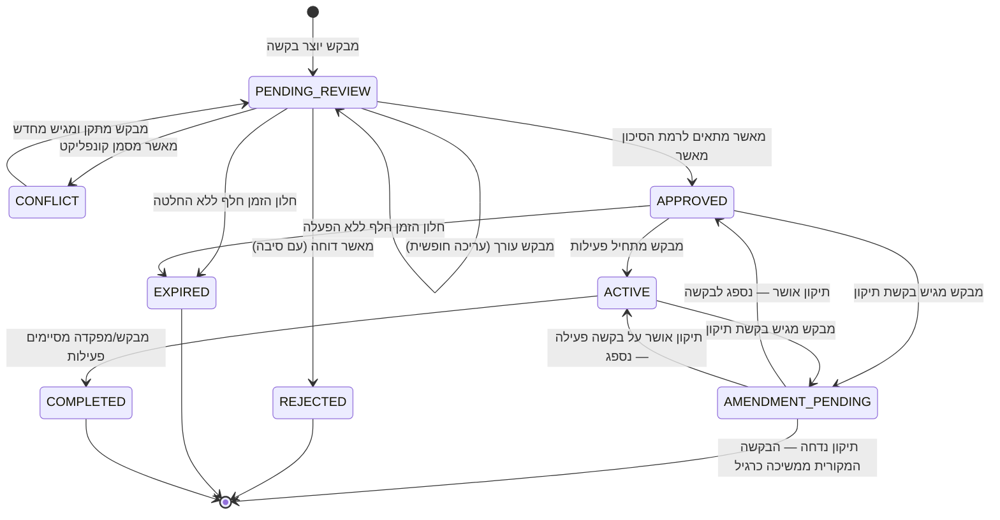

# אפיון מוצרי – חוקיות והרשאות בתהליך בקשת טיסה

מסמך זה הוא **אפיון מוצרי מחייב** — לא תיאור של מה שהמערכת עושה היום. הוא ממשיך ומרחיב את "אפיון פוליגוני טיסה — יצירה, הצגה וניהול", ומגדיר את החוקיות הנכונה לתהליך: מי רשאי לפעול, מתי, ומה קורה כתוצאה מכך. הכללים כאן מבוססים על שלושה מקורות:

1. **האפיון המקורי עצמו** — בפרט Story 7 ("לא ניתן לערוך בקשה לאחר אישור או דחייה **ללא תהליך מתאים**") ו-Story 13 (בקשת הארכה כתהליך נפרד ומאושר), ששניהם כבר רומזים על העיקרון המרכזי של מסמך זה.
2. **עקרונות מקובלים במערכות אישור מוסדריות** (Maker-Checker / Four-Eyes, Audit Trail, הפרדת תפקידים) הנהוגים במערכות בנקאיות, במערכות אישור שינויים ארגוניות (ITSM/Change Management), ובמערכות רישוי ממשלתיות.
3. **מערכות דומות בתחום התעופה/מרחב אווירי** — כפי שמפורט בסעיף 9.

---

## 1. עקרונות יסוד

### עקרון 1 — הפרדת תפקידים (Segregation of Duties)
מבקש הבקשה ("מפעיל") ומאשר הבקשה ("קצין רוק״ק/חמ״ק") הם שני תפקידים נפרדים במערכת, גם אם באותו רגע נתון אדם אחד ממלא את שניהם ארגונית. **המערכת חייבת לתמוך בזיהוי משתמש ותפקיד**, ולא להסתמך על "מי שיש לו גישה לאפליקציה". זהו עיקרון יסוד בכל מערכת אישורים רגולטורית (מקביל ל-Maker-Checker בעולם הבנקאות ואישורי תשלומים).

### עקרון 2 — שינוי אחרי אישור הוא "תיקון", לא "עריכה"
ברגע שבקשה אושרה (`APPROVED`) — ובוודאי אם היא כבר פעילה (`ACTIVE`) — **אסור** שעריכת שדה תמחק את האישור הקיים ותחזיר את הבקשה למצב "ממתין לאישור" באופן גורף. זהו בדיוק ההיגיון שכבר קיים ב-Story 13 (הארכת פעילות): הארכה היא **בקשה חדשה, מקושרת למקור**, שעוברת אישור בפני עצמה, ו**זמן הסיום המקורי נשאר בתוקף עד לאישור ההארכה**. העיקרון הזה נכון לא רק לזמן — הוא נכון לכל שינוי מהותי בבקשה מאושרת/פעילה: פוליגון, גובה, רחפן, סיווג.

המשמעות המעשית: **אין "עריכה" חופשית לבקשה מאושרת/פעילה — יש "בקשת תיקון".**

### עקרון 3 — האישור המקורי תקף עד לאישור התיקון
נגזרת ישירה מעיקרון 2: כל עוד בקשת התיקון ממתינה, הרחפן ממשיך לפעול לפי התנאים שאושרו במקור. אין מצב שבו הגשת תיקון "מפילה" את הפעילות הקיימת. זהו ההבדל הקריטי בין המודל הנוכחי (עריכה = איפוס לסטטוס ממתין) למודל הנכון.

### עקרון 4 — כל פעולה מתועדת ובלתי הפיכה (Audit Trail)
מי יצר, מי ערך, מי אישר/דחה, מתי, ומה בדיוק שונה — כולם שדות חובה שנשמרים לצמיתות ולא ניתנים למחיקה/שכתוב. זה לא "נחמד שיהיה" — זו דרישה בסיסית בכל מערכת שמנהלת אישורי שימוש במרחב מוסדר (בדיוק כמו רישום שינויים ב-NOTAM או ב-Change Request במערכות IT).

### עקרון 5 — מדרג סמכות אישור לפי רמת סיכון
לא כל בקשה שווה. המערכת כבר "יודעת" לסווג בקשה ל-GREEN/ORANGE/RED (כלי חמוש, חפיפת NFZ, קונפליקט מרחב) — אבל היום כל בקשה, בכל סיווג, מאושרת על ידי אותו "מי שנמצא מול המסך". החוקיות הנכונה: **ככל שהסיכון עולה, כך עולה רמת הסמכות הנדרשת לאישור** (ראו סעיף 6).

### עקרון 6 — עדכון גלוי, לא שקט
כל שינוי סטטוס, ובפרט כל שינוי שהמאשר מבצע בתוכן הבקשה (כמו קיצוץ גבולות פוליגון), **חייב** להיות גלוי, מתועד, ומיודע לצד השני באופן אקטיבי — לא רק "מסתנכרן ברקע אם המפעיל יזדמן להסתכל". זה נגזר ישירות מ-Story 8 המקורי: "הגורם המבקש מקבל **חיווי** שהפוליגון שונה".

---

## 2. תפקידים והרשאות

| תפקיד | מי זה | סמכויות |
|---|---|---|
| **מבקש (מפעיל)** | מפעיל הרחפן, אפליקציית אולר | יצירת בקשה, עריכה חופשית טרם אישור, הגשת בקשת תיקון/הארכה על בקשה מאושרת, התחלה/סיום פעילות, צפייה בהיסטוריה של הבקשות שלו |
| **מאשר רמה 1 (קצין רוק״ק/חמ״ק)** | HQ, web-app | אישור/דחיית בקשות בסיווג GREEN/ORANGE, קיצוץ/התאמת גבולות פוליגון בעת אישור, אישור/דחיית בקשות תיקון והארכה |
| **מאשר רמה 2 (מפקד גזרה)** | HQ, הרשאה מוגברת | כל סמכויות מאשר רמה 1, **בתוספת** סמכות ייחודית לאשר בקשות בסיווג RED (כלי חמוש, חפיפת NFZ, קונפליקט מרחב פעיל) |
| **צופה** | כל משתמש נוסף (למשל קצינים אחרים, גורמי מודיעין) | צפייה בלבד בתמונת המצב וההיסטוריה, ללא יכולת פעולה |
| **מערכת (אוטומטית)** | טיימרים/מנועי חוקיות | פקיעת תוקף אוטומטית, זיהוי חפיפות, סיווג ראשוני |

> ⚙️ **נדרש למימוש:** שכבת זיהוי משתמש/תפקיד (login + role) בשתי האפליקציות. ללא זה, אף אחת מההבחנות בטבלה לא ניתנת לאכיפה טכנית — היא תישאר "נוהל" בלבד, לא חוקיות מערכתית.

---

## 3. מודל הסטטוסים — עם שכבת "תיקון"

המודל הבסיסי (`PENDING_REVIEW → APPROVED → ACTIVE → COMPLETED`, עם ענפי `REJECTED`/`EXPIRED`/`CONFLICT`) נשאר כפי שהוגדר באפיון המקורי. הוא מתרחב בעיקרון חדש אחד:

**בקשת תיקון (Amendment Request)** — ישות חדשה, מקושרת לבקשה המקורית באמצעות `amendsRequestId`, שעוברת את אותו מסלול אישור (`PENDING_REVIEW → APPROVED/REJECTED`) **בפני עצמה**, מבלי לשנות את סטטוס הבקשה המקורית עד לרגע שבו התיקון עצמו אושר. ברגע האישור — השדות שהשתנו "נספגים" לתוך הבקשה המקורית, והתיקון עצמו נשמר בהיסטוריה כרשומה.

זה בדיוק המודל שכבר קיים היום ל"הארכת פעילות" (Story 13) — המסמך הזה רק אומר: **תשתמשו באותו מודל לכל שינוי בבקשה מאושרת/פעילה**, לא רק לזמן.

> הערה: `AMENDMENT_PENDING` הוא לא סטטוס חדש שמחליף את סטטוס הבקשה המקורית — הוא סטטוס של **רשומת התיקון הנלווית**. הבקשה המקורית ממשיכה להיות מוצגת כ-`APPROVED`/`ACTIVE` כרגיל, עם סימון חזותי ("יש תיקון ממתין לאישור") לצד זה.

---

## 4. כללי עריכה — הטבלה המחייבת

| סטטוס הבקשה | מי רשאי | סוג הפעולה | מה קורה לסטטוס |
|---|---|---|---|
| `PENDING_REVIEW` | המבקש בלבד (יוצר הבקשה) | עריכה חופשית מלאה | נשאר `PENDING_REVIEW`, מוצג כמעודכן |
| `CONFLICT` | המבקש בלבד | עריכה חופשית (תיקון הבעיה שצוינה) | חוזר ל-`PENDING_REVIEW` |
| `APPROVED` / `ACTIVE` | המבקש בלבד | **בקשת תיקון** (לא עריכה ישירה) | הבקשה המקורית **נשארת ללא שינוי** עד אישור/דחיית התיקון |
| `APPROVED` (בלבד) | מאשר רמה 1/2, כחלק מתהליך האישור עצמו | התאמת גבולות פוליגון לפני אישור סופי | לא משנה סטטוס — משנה את הפוליגון שיאושר בפועל; **חובה חיווי למבקש** |
| `REJECTED` / `EXPIRED` / `COMPLETED` | אף אחד | אין עריכה. ניתן רק "להגיש בקשה חדשה על בסיס זו" (שכפול לבקשה טרייה) | — |

**מדוע לא לאפשר עריכה ישירה של `APPROVED`/`ACTIVE`?** כי עריכה ישירה, מטבעה, יוצרת אחד משני מצבים גרועים: או שהיא "שוברת" את האישור הקיים (המצב הנוכחי — מסוכן, כי רחפן פעיל מאבד סטטוס מאושר), או שהיא "שקטה" ולא עוברת אישור בכלל (מסוכן לא פחות — שינוי מהותי בלי בקרה). מודל בקשת התיקון פותר את שתי הבעיות: האישור הקיים לא נפגע, והשינוי כן עובר בקרה.

---

## 5. כללי אישור ומדרג סמכות

1. מאשר לא יכול לאשר בקשה שהוא עצמו הגיש (הפרדת תפקידים — עקרון 1).
2. בקשה בסיווג **GREEN/ORANGE** → מספיק אישור **מאשר רמה 1**.
3. בקשה בסיווג **RED** (כלי חמוש, חפיפת NFZ, קונפליקט מרחב פעיל) → מחייבת אישור **מאשר רמה 2 (מפקד גזרה)** בלבד. זהו בדיוק העיקרון שכבר מרומז היום בטקסטים של הקונפליקטים עצמם ("מחייב אישור מפקד גזרה") — אבל היום שום דבר לא אוכף את זה בפועל; כל מאשר יכול ללחוץ "אשר" על בקשת RED. יש לתקן זאת כך שכפתור האישור על בקשת RED זמין רק למאשר ברמה המתאימה.
4. דחיית בקשה **מחייבת** הזנת סיבה (שדה חובה, לא אופציונלי).
5. בכל אישור/דחייה נשמרים: זהות המאשר, תפקידו, וחותמת זמן — לצמיתות, כחלק מרשומת הבקשה.
6. אישור בקשת תיקון/הארכה עובר את **אותה** חוקיות מדרג סיכון כמו בקשה רגילה (אם התיקון עצמו מעלה את הסיווג ל-RED — למשל הגדלת גובה מעל התקרה — הוא עולה לאישור מאשר רמה 2, גם אם הבקשה המקורית אושרה ב-GREEN).

---

## 6. עריכת פוליגון ע"י המאשר (Story 8, בפירוט מחייב)

זהו תהליך שונה מ"בקשת תיקון" — כאן **המאשר** הוא זה שמשנה, כחלק מתהליך האישור עצמו (למשל: מצמצם פוליגון כדי למנוע חפיפה, לפני שהוא מאשר).

**חוקיות מחייבת:**
1. פעולה זו זמינה רק **לפני** האישור הסופי (כלומר, על בקשה ב-`PENDING_REVIEW`/`CONFLICT` שעומדת להיות מאושרת) — לא על בקשה שכבר `APPROVED`. אם צריך לשנות פוליגון מאושר בדיעבד — זה עובר דרך "בקשת תיקון" הרגילה (סעיף 4), הפעם ביוזמת HQ שמבקש מהמבקש להסכים/להגיש.
2. נשמרים **שני הפוליגונים**: המקורי שהתבקש, והמאושר בפועל (בהתאם לדרישה המפורשת ב-Story 8).
3. ברגע האישור, המבקש מקבל **חיווי אקטיבי וברור** ("הפוליגון שאושר שונה מזה שביקשת — לחץ לצפייה בהבדל"), לא רק עדכון שקט של הגאומטריה על המפה.
4. המבקש **לא** יכול לדחות את השינוי אחרי אישור — אם הוא לא מסכים לגבולות שאושרו, הוא פותח בקשת תיקון חדשה כמו כל שינוי אחר.

---

## 7. התרעות וסנכרון — דרישות מחייבות

| אירוע | חובת התרעה |
|---|---|
| בקשה אושרה/נדחתה/סומנה כקונפליקט | התרעה אקטיבית (Push/צליל/הבהוב) למבקש — לא רק עדכון שקט ברשימה |
| המאשר שינה גבולות פוליגון בעת אישור | התרעה ייעודית + הצגת השוואה בין המבוקש למאושר |
| בקשת תיקון/הארכה אושרה/נדחתה | התרעה אקטיבית למבקש |
| בקשה עומדת לפוג תוקף (התחלה/סיום) | התרעה מוקדמת (כבר קיים לחלק מהמקרים — יש להשלים לכל הסטטוסים הרלוונטיים) |
| כל שינוי בבקשה | חייב לעבור **דרך שכבת השרת המרכזית** (persist + broadcast) — לעולם לא state מקומי בלבד בצד לקוח אחד |

---

## 8. מודלים דומים בעולם — מה שאיבנו מהם

| מערכת/עקרון בעולם | מה רלוונטי כאן |
|---|---|
| **LAANC (FAA UAS Authorization)** — אישור טיסת רחפנים מול בקרת טיסה אזרחית בארה״ב | הפרדה ברורה בין אישור אוטומטי/מהיר (איזורים "ירוקים") לבין דרוש אישור ידני של בקר אנושי (איזורים מוגבלים) — תואם למדרג הסמכות שהוגדר בסעיף 6 לפי סיווג GREEN/ORANGE/RED. גם שם: מבקש לא יכול לשנות בקשה שכבר אושרה — רק לבטל ולהגיש מחדש. |
| **ACM / NOTAM (תיאום מרחב אווירי צבאי/אזרחי)** | פרסום/הפעלה/ביטול של מרחב אווירי מתועד תמיד כפעולה פורמלית עצמאית עם timestamp — אף אחד לא "עורך" ACM קיים בשקט; מפרסמים תיקון (Amendment). זה המקור הישיר לעקרון "בקשת תיקון" (סעיף 2, עיקרון 2). |
| **Maker-Checker / Four-Eyes** (בנקאות, מערכות תשלומים, Change Management ב-IT) | מבקש ומאשר הם תפקידים נפרדים; המבקש לא יכול לאשר את עצמו; כל שינוי לאחר אישור עובר כ-Change Request נפרד, לא כעריכה ישירה של הרשומה המאושרת. |
| **מערכות רישוי/היתרי בנייה ממשלתיים** | מאשר יכול "לאשר עם הסתייגויות/שינויים", אבל זה תמיד מוצג למבקש כגרסה מפורשת שהוא צריך לראות ולהכיר בה — לא כדיף שקט. תואם ישירות לסעיף 6. |
| **מדרג סמכות אישור לפי סכום/סיכון** (אישורי הוצאות כספיות ארגוניות, deployment approvals) | ככל שהסיכון/היקף עולה, נדרשת דרג אישור גבוה יותר — בדיוק העיקרון שהוחל כאן על סיווג RED מול GREEN/ORANGE. |

---

## 9. טבלת הרשאות מוצרית — סיכום סופי

| פעולה | מבקש | מאשר רמה 1 | מאשר רמה 2 |
|---|---|---|---|
| יצירת בקשה | ✅ | ❌ | ❌ |
| עריכה חופשית (טרם אישור) | ✅ (רק היוצר) | ❌ | ❌ |
| אישור בקשה GREEN/ORANGE | ❌ | ✅ | ✅ |
| אישור בקשה RED | ❌ | ❌ | ✅ בלבד |
| דחיית בקשה (עם סיבה) | ❌ | ✅ | ✅ |
| התאמת גבולות פוליגון לפני אישור | ❌ | ✅ | ✅ |
| הגשת בקשת תיקון/הארכה על בקשה מאושרת/פעילה | ✅ (רק היוצר) | ❌ | ❌ |
| אישור/דחיית בקשת תיקון | ❌ | ✅ (לפי אותו מדרג סיכון) | ✅ |
| התחלת/סיום פעילות בפועל | ✅ (רק היוצר) | ❌ | ❌ |
| צפייה בהיסטוריה/תחקור | ✅ (בקשות שלו) | ✅ (כל הבקשות) | ✅ (כל הבקשות) |

---

## 10. נספח — יחס למסמך "מה קורה היום"

מסמך זה הוא שכבת המדיניות המחייבת. הפערים בין המימוש הקיים לבין המדיניות כאן (למשל: עריכת בקשה `ACTIVE` היום מאפסת אותה ל-`PENDING_REVIEW` במקום ליצור בקשת תיקון; עריכת גבולות ע"י HQ לא מסונכרנת כלל היום) מתועדים בפירוט ב-**"מסמך חוקיות - התגלגלות בקשת טיסה.md"**. אותו מסמך משמש כעת כ**רשימת פערי מימוש** שיש לסגור כדי להגיע לחוקיות המתוארת כאן — לא כמקור לחוקיות עצמה.
